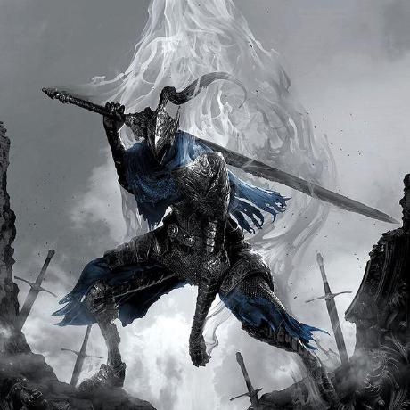

# Отчет по лабораторной работе №1: "Калькулятор. HTML/CSS"

## Содержание

1. [Название работы](#1-название-работы)
2. [Цель работы](#2-цель-работы)
3. [Основное задание (Калькулятор)](#3-основное-задание-калькулятор)
4. [Дополнительное задание (Визитка)](#4-дополнительное-задание-визитка)

---

## 1. Название работы

**Тема:** Разработка пользовательских интерфейсов веб-сайтов с использованием HTML и CSS. Создание многостраничного приложения "Калькулятор".

---

## 2. Цель работы

Знакомство с инструментами построения пользовательских интерфейсов веб-сайтов: HTML, CSS. Практическое освоение верстки, работы со свойствами селекторов, построения многостраничной структуры сайта и интеграции ссылок.

---

## 3. Основное задание

Реализована страница калькулятора (`Calculator.html`) и стили (`style.css`), задающие сетку интерфейса, круглые кнопки и цветовые акценты.

### Разметка калькулятора (`Calculator.html`)

```html
<div id="calc-body" class="calc-body">
    <div id="result" class="calc-result">0</div>
    <div>
        <button id="btn_op_clear" class="button extra">C</button>
        <button id="btn_op_div" class="button operations">/</button>
    </div>
    <div>
        <button id="btn_digit_7" class="button numbers">7</button>
        <button id="btn_op_mult" class="button operations">x</button>
    </div>
    <div>
        <button id="btn_digit_0" class="button numbers">0</button>
        <button id="btn_op_equal" class="button result">=</button>
    </div>
</div>
```

### Стили интерфейса (style.css)

```css
CSS .calc-body {
    margin-left: 5%;
    margin-top: 55px;
    width: 300px;
    height: 450px;
    background-color: black;
    padding: 25px;
    border-radius: 25px;
}
.calc-result {
    height: 60px;
    border: 1px solid rgb(69, 69, 69);
    font-size: xxx-large;
    color: rgb(211, 50, 5);
    background-color: rgb(69, 69, 69);
    text-align: right;
}
.button {
    margin-top: 10px;
    width: 65px;
    height: 65px;
    background-color: rgb(180, 180, 183);
    border: none;
    font-size: xx-large;
    cursor: pointer;
    border-radius: 45px;
}
.button.operations {
    background-color: rgb(211, 50, 5);
}
.button.operations:hover {
    background: rgb(164, 39, 5);
}
```

---

## 4. Дополнительное задание

Создана главная страница-визитка (index.html). На ней размещена шапка навигации, информация о создателе и заказчике в виде интерактивных карточек.

### Разметка карточки создателя (index.html)

```html
<div class="card creator">
    <h1>Creator</h1>
    <div class="splitter"></div>
    <div class="info">
        <div class="text">
            <h2>GROUP: IU5-43</h2>
            <h2>Burov Roman</h2>
        </div>
        <a
            class="link in_card"
            href="[https://github.com/Artorias250](https://github.com/Artorias250)"
        >
            
        </a>
    </div>
</div>
```

### Стилизация карточек (style.css)

```css
.card {
    width: 40%;
    height: 285px;
    color: aliceblue;
    background-color: black;
    border-radius: 50px;
    margin-top: 3%;
    font-family: Arial, sans-serif;
    transition: transform 0.2s;
}
.card:hover {
    transform: scale(1.03);
}
.splitter {
    height: 5px;
    width: 100%;
    background-color: rgb(211, 50, 5);
}
.link-img {
    width: 100%;
    border-radius: 70px;
}
```
